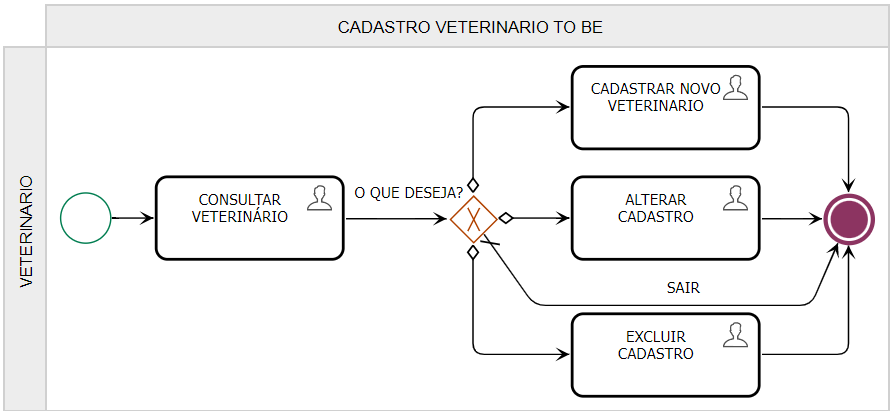
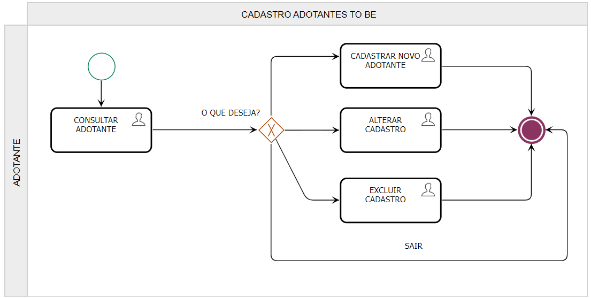
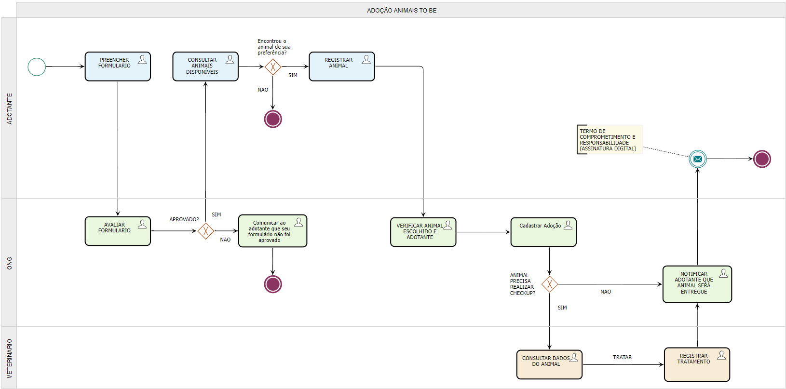
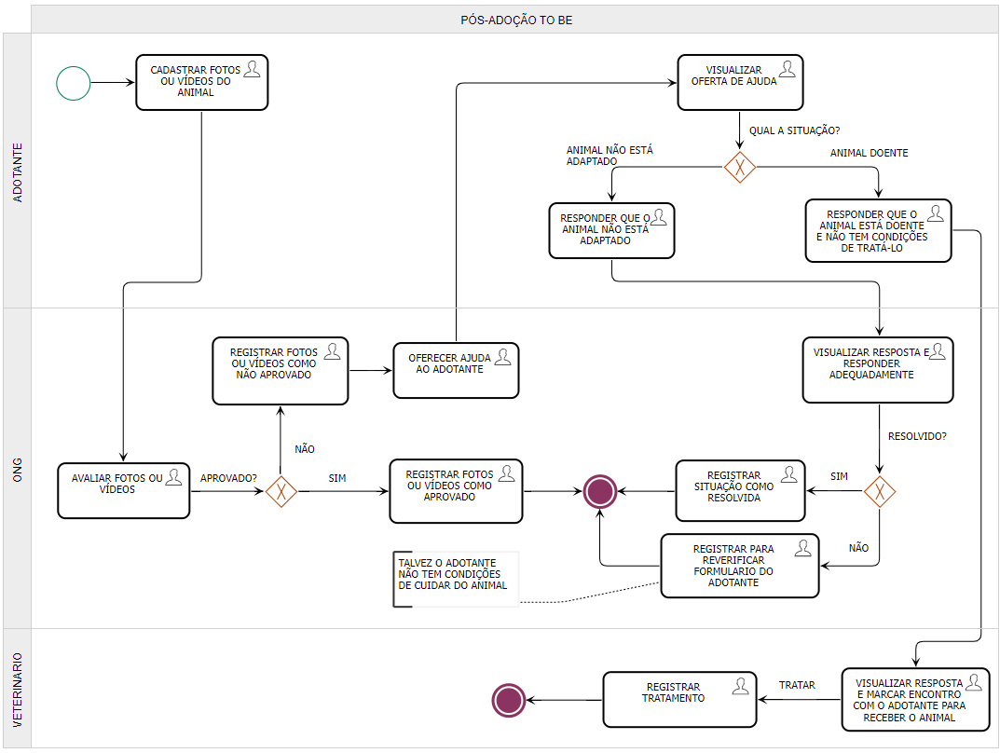
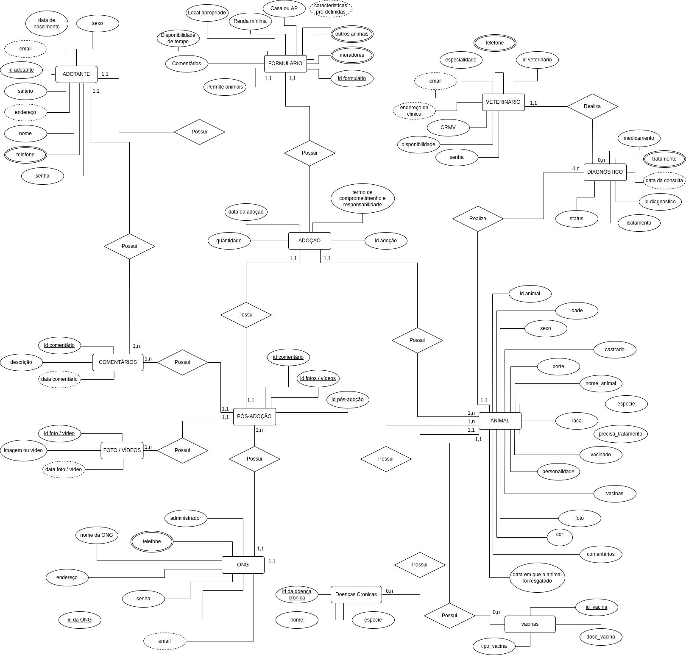

# Adoção de Animais

`SISTEMAS DE INFORMAÇÃO`

`APLICAÇÕES PARA PROCESSOS DE NEGÓCIOS - TURMA 01`

`2021/2`

Trabalho apresentado à disciplina Aplicações para Processos de Negócios do Curso de Bacharelado em Sistemas de Informação da Pontifícia Universidade Católica de Minas Gerais.

## Integrantes

* Bruno Henrique Morais de Oliveira1
* Cleverson Christian da Rocha
* Luiz Carlos Muschioni
* Maitê Luise Freitas de Almeida Santos
* Thainara Pereira Dias
* Theo Antolin Diamantino

## Professora

* Eveline Alonso Veloso

### Belo Horizonte 2021</br>

### RESUMO

&emsp;&emsp;Este projeto aborda a identificação do processo de adoção de animais abandonados e da divulgação desses animais para adoção por ONGs de Proteção Animal. Para isto foi realizado um levantamento buscando entender o processo atual com o intuito de identificar os pontos onde a tecnologia possa contribuir para otimização deste processo. Deste modo, a pesquisa reporta as principais tecnologias e meios de comunicação utilizados no momento, como também caminha para o desenvolvimento de propor um sistema que amplie a divulgação de animais domésticos que estão para adoção em ONGs e acompanhe o processo de adaptação pós-adoção.

Palavras-chave: Adoção. ONGs. Animais.

### SUMÁRIO

* [1 INTRODUÇÃO](#introducao)<a name="sumario"></a>
* [1.1 OBJETIVO GERAL](#geral)
* [1.1.1 OBJETIVOS ESPECÍFICOS](#especificos)
* [1.2 JUSTIFICATIVA](#justificativa)
* [2 PARTICIPANTES DO PROCESSO DE NEGÓCIO](#participantes)
* [3 MODELAGEM DO PROCESSO DE NEGÓCIO](#modelagem)
* [3.1 ANÁLISE DA SITUAÇÃO ATUAL (AS-IS)](#atualAS)
* [3.1.1 Processo de Cadastro de Animais (AS-IS)](#animaisAS)
* [3.1.2 Processo de Cadastro de Clínicas Veterinárias Parceiras e Veterinários Voluntários (AS-IS)](#clinicasAS)
* [3.1.3 Processo de Cadastro de Adotantes (AS-IS)](#adotantesAS)
* [3.1.4 Processo de Adoção (AS-IS)](#adocaoAS)
* [3.1.5 Processo de Pós-Adoção (AS-IS)](#posAS)
* [3.2 MODELAGEM DOS PROCESSOS APRIMORADOS (TO-BE)](#modelagemTO)
* [3.2.1 Processo de Cadastro de ONG e Abrigo (TO-BE)](#ongTO)
* [3.2.2 Processo de Cadastro de Clínicas Veterinárias Parceiras e Veterinários Voluntários (TO-BE)](#clinicasTO)
* [3.2.3 Processo de Cadastro de Animais (TO-BE)](#animaisTO)
* [3.2.4 Processo de Cadastro de Adotantes (TO-BE)](#adotantesTO)
* [3.2.5 Processo de Adoção (TO-BE)](#adocaoTO)
* [3.2.6 Processo de Pós-Adoção (TO-BE)](#posTO)
* [4 PROJETO DA ARQUITETURA DE DADOS DA SOLUÇÃO PROPOSTA](#arquitetura)
* [4.1 DIAGRAMA DE ENTIDADES E RELACIONAMENTOS (DER)](#der)
* [4.2 IMPACTOS DA IMPLEMENTAÇÃO EM UM BANCO DE DADOS NOSQL](#noSQL)
* [4.3 MODELO RELACIONAL](#relacional)
* [4.4 ESBOÇO DE CONSULTAS COM SQL DE ACORDO COM AS NECESSIDADES DOS PARTICIPANTES DO PROCESSO](#consultaSQL)
* [5 RELATÓRIOS ANALÍTICOS](#analiticos)
* [5.1 ASSOCIAÇÃO DE COMANDOS SQL COM RELATÓRIOS ANALÍTICOS](#comandosSQL)
* [6 INDICADORES DE DESEMPENHO](#indicadores)
* [7 CONCLUSÃO](#conclusao)
* [REFERÊNCIAS](#ref)

### [1 INTRODUÇÃO](#sumario) <a name="introducao"></a>

&emsp;&emsp;A escolha do tema do projeto nasceu durante discussões referentes aos temas sugeridos para o projeto Aplicações para Processos de Negócios. O grupo vislumbrou a oportunidade de desenvolver uma plataforma que fomente e facilite o processo de adoção de animais abandonados.  
&emsp;&emsp;Segundo publicação da ANDA, Agência de Notícias de Direitos Animais, no site da Jusbrasil, “A Organização Mundial da Saúde estima que só no Brasil existam mais de 30 milhões de animais abandonados, entre 10 milhões de gatos e 20 milhões de cães.” (ANDA, 2013). Atualmente, a internet é a principal fonte de divulgação de eventos de adoção de animais, como também de protestos contra as injúrias que os animais sofrem.  
&emsp;&emsp;Em uma sociedade digital, na qual existem vários aplicativos que utilizam algoritmos para análise de perfis de usuários, tomamos como exemplo um aplicativo de relacionamento de pessoas. Nesse aplicativo, tem uma funcionalidade denominada match (palavra de origem inglesa, usada como verbo nessa ocasião, que pode significar: combinar, igualar, corresponder), com o sentido de definir o melhor casal, utilizada através de pesquisas feitas pelos usuários. Isso nos levou a um questionamento até mesmo simplório. Por que não aplicar o mesmo conceito para a adoção de animais?  
&emsp;&emsp;Dentre os objetivos do projeto, um deles envolve o desenvolvimento de uma plataforma de dados que possibilita a criação de perfis completos de adotantes, que por sua vez podem escolher o perfil de um animal disponível para adoção. Dessa forma, criando o match necessário para uma adoção assertiva, eliminando assim o risco de novo abandono. A proposta também busca remover empecilhos que possam dificultar o processo de adoção.  
&emsp;&emsp;A facilidade tecnológica atual propicia o acesso rápido à informação, seja por meio de sites, redes sociais e aplicativos. O intuito é desenvolver um sistema que tenha uma base de dados baseada nos três pilares da informação: confidencialidade, integridade e disponibilidade. Assim, as partes envolvidas terão um recurso em mãos, disponível a qualquer momento e sem a necessidade de se deslocar por vários locais, somente quando for indispensável.  

### [1.1 OBJETIVO GERAL](#sumario) <a name="geral"></a>

&emsp;&emsp;Propor a utilização de um Sistema Gerenciador de Banco de Dados (SGBD) para o negócio de adoção de animais. Os dados dos participantes do negócio estarão armazenados em um banco de dados próprio para cada um, nos quais irão se relacionar, tornando assim mais prático a consulta, inclusão, alteração ou exclusão.

### [1.1.1 OBJETIVOS ESPECÍFICOS](#sumario) <a name="especificos"></a>

&emsp;&emsp;Propiciar o cadastro dos dados de ONGs ou abrigos de animais na plataforma. As informações das ONGs ou dos abrigos serão declaradas pelas próprias entidades, para que então possam desenvolver o papel principal no negócio.  
&emsp;&emsp;Permitir a inclusão dos dados de clínicas veterinárias parceiras das ONGs ou dos abrigos, assim como de veterinários voluntários. As informações serão prestadas pelas clínicas e veterinários.  
&emsp;&emsp;Possibilitar o cadastro dos dados de pessoas interessadas em adotar animais, caracterizadas como adotante. As informações do adotante serão disponibilizadas pela própria pessoa.  
&emsp;&emsp;Dispor na plataforma os dados do adotante aprovado (aceitação do formulário de adoção com requisitos mínimos) pela ONG ou pelo abrigo e do animal disponível para adoção, assim o adotante pode escolher o animal sem precisar se deslocar por diversos locais.  
&emsp;&emsp;Proporcionar para as ONGs e abrigos e, quando necessário, para as clínicas veterinárias ou veterinários voluntários, o controle dos animais que foram adotados, utilizando os dados que estão armazenados.  

### [1.2 JUSTIFICATIVA](#sumario) <a name="justificativa"></a>

&emsp;&emsp;O trabalho realizado por ONGs de Proteção Animal e abrigos de animais, vai além do processo de adoção. Essas entidades se organizam para disponibilizar pelo menos o mínimo necessário para os animais, até mesmo não tendo nenhum tipo de contribuição vinda de uma instituição do governo. Dessa forma, elas aceitam doações de ração, dinheiro, itens e produtos, bem como o voluntariado de pessoas dispostas a colaborar.  
&emsp;&emsp;Tendo em vista o trabalho excepcional que as organizações que protegem animais exercem, sendo que a maioria não tem nenhum apoio do governo, elas ainda mantêm o controle de natalidade, mortalidade, abandono, resgate e tratamento dos animais.  
&emsp;&emsp;Devido à grande quantidade de animais abandonados, o governo federal tomou medidas e publicou a lei federal 13.426/2017, que trata do controle de natalidade de cães e gatos considerados como animais de rua. A referida lei foi sancionada com dois vetos cruciais. O primeiro veto retirou a responsabilidade dos municípios na aplicação da lei e consequentemente dos centros de zoonose. O custeio das despesas para implantação do programa, no qual deveriam vir do poder público federal e municipal, foram razão do outro veto, pois impactaria o equilíbrio fiscal almejado pelo governo.  
&emsp;&emsp;O Observatório Eco (2017) destacou que “A existência de um trabalho sério e responsável de controle de natalidade de cães e gatos só irá existir se as ONGs se movimentarem para a lei cumprir sua finalidade, no que depender da vontade do agente público, muito pouco ou nada será feito.”.  
&emsp;&emsp;Diante disso, a plataforma pode trazer soluções mais eficazes para o trabalho desempenhado pelas entidades de proteção animal, como por exemplo, estudos analíticos através de ferramentas de *Business Intelligence* para melhor identificar os fatores que influenciam os indicadores dos controles efetuados por essas entidades.  
&emsp;&emsp;A princípio, o objetivo é propor a criação de um sistema que funcione como uma rede entre as pessoas e organizações que querem o bem-estar dos animais, especialmente, cães e gatos. A partir disso, a plataforma a ser utilizada pelos usuários proporciona a otimização de tempo no processo de adoção e mais mobilidade cujo modelo atual não oferece, com o uso da plataforma o deslocamento é feito somente em casos de necessidade.  
&emsp;&emsp;A adoção de animais é levada a sério por ONGs e abrigos, devido a isso, somente permitem que uma pessoa adote um animal após visitar sua residência e verificar se nela possui a infraestrutura adequada, como também se a pessoa tem condições financeiras e se sua personalidade condiz para adotar um animal. Sendo assim, a plataforma permite realizar a seleção de candidatos com maior potencial de adoção, usando recursos de Business Intelligence. Ainda assim, se for identificado a necessidade de uma visita ao candidato selecionado, a margem de erro é bem menor, não sendo preciso recomeçar todo o processo, pois o candidato está mais alinhado com as expectativas da organização.  
&emsp;&emsp;A facilidade de acompanhamento posterior à adoção, provida aos usuários, é uma utilidade que no modelo em uso não existe, devido às diversas transições que os participantes fazem. No acompanhamento, pelo fato dos dados do animal estarem cadastrados no sistema, eles podem ser consultados e alterados, bem como podem ser incluídos ou excluídos novos dados, de modo que isso vai aprimorar a execução dessa atividade.  
&emsp;&emsp;Existem animais, no caso, cães e gatos, que têm um microchip implantado sob sua pele e que está vinculado ao seu tutor. O microchip serve para que seja feita a identificação do animal e de seu responsável no caso dele se perder. Os dados contidos nesse microchip podem ser lidos por alguém que tenha o leitor do referido microchip, nos quais estão cadastrados em um banco de dados. Como o cadastro dos dados desses microchips são feitos em diversos bancos de dados, isso foi visto como uma limitação para o projeto, pois não há condições de agregar tantos dados vindos de outros bancos, sendo que eles podem estar moldados de diferentes formas como também podem ter diferentes estruturas. Mas cabe dizer que a leitura dos dados dos animais e inclusão no sistema é uma possibilidade, para assim aumentar a rede de proteção animal.  
&emsp;&emsp;Em suma, o desenvolvimento deste sistema não tem apenas o objetivo de ser mais uma solução tecnológica, mas promover o cuidado, carinho e atenção aos animais, utilizando a tecnologia como recurso.  

### [2 PARTICIPANTES DO PROCESSO DE NEGÓCIO](#sumario) <a name="participantes"></a>

&emsp;&emsp;Os participantes do negócio de adoção de animais, também denominado *stakeholders*, cumprem diferentes papéis, desempenhando funções que influenciam e interessam a todos os processos, de forma que afetam as atividades diretamente. Eles são caracterizados da seguinte maneira:  
> - ONG - entidade que não tem fins lucrativos e pratica ações solidárias para um público específico, nessa ocasião, a proteção animal. Ela pode atuar em conjunto com abrigos de animais. Desempenha a função de cadastrar os animais disponíveis para adoção e de manter o controle deles durante os processos.
> - Adotante - pessoa que deseja adotar um animal. Desempenha a função de pesquisar o seu animal de interesse, assim como de ser aprovado pelas organizações que cuidam do animal. O adotante deve também informar sobre as condições do animal no processo de pós-adoção, para que o controle do animal seja permanentemente feito.
> - Clínica Veterinária Parceira e Veterinário Voluntário - geralmente uma ONG ou um abrigo de proteção de animais, não têm condições financeiras para se sustentar, deste modo, fazem parcerias com empresas ou com profissionais autônomos que podem tratar da saúde dos animais. Assim, esses participantes têm um importante papel no negócio, pois são responsáveis por analisar como está a saúde de cada animal na sua chegada a essas organizações, além de efetuar algum tratamento neles, quando for solicitado.  

### [3 MODELAGEM DO PROCESSO DE NEGÓCIO](#sumario) <a name="modelagem"></a>

### [3.1 ANÁLISE DA SITUAÇÃO ATUAL (AS-IS)](#sumario) <a name="atualAS"></a>

&emsp;&emsp;No atual modelo de negócio de adoção animal, os envolvidos estão ligados em uma cadeia, mas se perdem pelo fato de não existir uma linha de conexão direta entre as diversas fases do processo.  
&emsp;&emsp;Abrigos e ONGs, coletam animais que foram abandonados ou recebem animais doados para adoção. Os animais recém chegados precisam ser tratados, contando com a intervenção veterinária para controle populacional e de zoonoses, para então, serem disponibilizados para adoção. Esses são os procedimentos básicos a serem executados, pois a oportunidade de conseguir um lar para esses animais conta também com outra barreira a ser superada, que é a atitude do candidato de se deslocar até o local onde o animal se encontra.  
&emsp;&emsp;Normalmente, uma pessoa interessada em adotar um animal, somente pode adotá-lo após ter sua residência visitada para verificar se ela tem a infraestrutura adequada, além de ter que fazer uma avaliação para certificar que ela tem condições financeiras e que tem a personalidade condizente. Esses questionamentos e avaliações são feitas, usualmente, através de um formulário, porém a organização e redundância de dados podem ser um problema encontrado nesse modelo, de modo que uma pessoa reprovada pode reenviar o formulário.  
&emsp;&emsp;Uma forma de impulsionar a adoção de animais são as feiras de adoção, que esporadicamente são promovidas por instituições privadas, ONGs ou órgãos públicos. Além disso, o investimento em mídia é feito em eventuais panfletagens ou em placas nos estabelecimentos próximos aos locais onde os animais estão abrigados.  
&emsp;&emsp;Muitos animais ficam sem ser adotados e acabam passando pelo processo de eutanásia ocasionada pela idade ou condição física especial.  
&emsp;&emsp;O fator principal que prejudica este modelo está diretamente voltado à comunicação entre as partes. A deficiência na gestão dos processos, faz com que os participantes não tenham plena consciência do que está acontecendo e isso afeta importantes atividades.  

### [3.1.1 Processo de Cadastro de Animais (AS-IS)](#sumario) <a name="animaisAS"></a>

&emsp;&emsp;Devido ao modelo atual ser executado de forma manual (sem um sistema integrado), o recebimento de animais em organizações e os procedimentos a serem realizados, estão resumidos em somente um processo, denominado cadastro de animais.  

Figura 1 - Modelo AS-IS do processo de cadastro de animais<p>
<p>
Fonte: Os autores.  

### [3.1.2 Processo de Cadastro de Clínicas Veterinárias Parceiras e Veterinários Voluntários (AS-IS)](#sumario) <a name="clinicasAS"></a>

&emsp;&emsp;As ONGs e abrigos de adoção animal precisam cuidar da saúde dos animais. Mas pelo fato de não terem condições financeiras para isso, elas fazem parcerias com clínicas veterinárias e até mesmo com veterinários que se voluntariam para cuidar dos animais.  
&emsp;&emsp;O processo se baseia em entrar em contato com as clínicas ou veterinários que queiram fazer esta parceria ou divulgar nos sites e redes sociais a causa. Os voluntários se comovem e se cadastram nestas organizações, para assim poder ajudar os animais.  

Figura 2 - Modelo AS-IS do processo de cadastro de clínicas veterinárias parceiras e veterinários voluntários<p>
<p>
Fonte: Os autores.  

### [3.1.3 Processo de Cadastro de Adotantes (AS-IS)](#sumario) <a name="AdotantesAS"></a>

&emsp;&emsp;As pessoas que têm interesse em adotar um animal precisam entrar em contato com as ONGs para descobrir onde e quando acontecerá uma feira de adoção. Elas, também, frequentemente, acessam os sites e redes sociais dessas organizações para procurar animais.  
&emsp;&emsp;Sem um cadastro prévio do possível candidato para adoção, as ONGs não conseguem fazer uma triagem eficiente dos candidatos e também não possuem um canal eficaz de comunicação e publicação de animais para adoção. É um processo bastante manual e que depende de vários deslocamentos para conseguir localizar um animal.  

Figura 3 - Modelo AS-IS do processo de cadastro de adotantes<p>
<p>
Fonte: Os autores.  

### [3.1.4 Processo de Adoção (AS-IS)](#sumario) <a name="adocaoAS"></a>

&emsp;&emsp;O processo de adoção tem início com a ONG verificando os relatórios com as informações disponíveis dos animais e conferindo os dados do animal que o adotante escolheu. Nessa avaliação, o estado de saúde do animal é examinado, caso ele tenha algum problema de saúde, a pessoa responsável na ONG entra em contato com  o veterinário responsável pelo animal para que seja feito uma avaliação de saúde. O animal é enviado para a clínica veterinária para realizar o *check-up* veterinário. Após a liberação do animal, é marcado um encontro com o adotante para entregar o animal, no qual assina o Termo de Comprometimento e Responsabilidade e, o processo é finalizado.  

Figura 4 - Modelo AS-IS do processo de adoção<p>
<p>
Fonte: Os autores.  

### [3.1.5 Processo de Pós-Adoção (AS-IS)](#sumario) <a name="posAS"></a>

&emsp;&emsp;O processo de pós-adoção tem início com o adotante enviando fotos ou vídeos do animal para a pessoa responsável na ONG. Ela analisa as fotos ou vídeos, se forem aprovadas, é sinal que o animal está sendo bem cuidado. Caso não sejam aprovadas, ela entra em contato com o adotante e pergunta se está havendo algo de errado.  
&emsp;&emsp;O adotante responde qual dificuldade está tendo. A pessoa responsável na ONG avalia a situação do adotante e toma as devidas providências. Na hipótese de ser algo relacionado à adaptação do animal, a própria entidade consegue resolver. Se o problema for solucionado, a ONG dá como resolvido este caso, mas se não for possível solucionar, a ONG atenta o adotante e repensa se o animal pode continuar com ele.  
&emsp;&emsp;Na circunstância do animal estar doente e o adotante não ter recursos para tratá-lo, a pessoa responsável na ONG entra em contato com o veterinário para dizer que um animal precisa de tratamento. O veterinário recebe o animal e o trata. Após isso, atualiza sua ficha de saúde e o libera.  

Figura 5 - Modelo AS-IS do processo de pós-adoção<p>
<p>
Fonte: Os autores.

### [3.2 MODELAGEM DOS PROCESSOS APRIMORADOS (TO-BE)](#sumario) <a name="modelagemTO"></a>

&emsp;&emsp;Visando sanar as dores do modelo de negócio atual, tem-se como objetivo, através de recursos tecnológicos, criar o Sistema Integrado de Controle de Adoção de Animais, com as seguintes características:  
> - Gerir as pessoas que têm interesse em adotar animais;
> - Realizar a integração entre ONGs, parceiros e comunidade;
> - Fazer o acompanhamento preventivo e preditivo dos animais;
> - Gerar maior escalabilidade no processo de adoção;
> - Acelerar o processo de adoção.
Inicialmente, o sistema conta com os seguintes recursos:
> - Cadastro de ONGs e Abrigos com o objetivo de que desenvolvam o papel de administradoras e organizadoras do negócio;
> - Cadastro de adotantes com o objetivo de aproximá-los das entidades de adoção de animais;
> - Cadastro de animais com o objetivo de dar maior visibilidade às pessoas interessadas em adotá-los;
> - Controle da saúde do animal para que seja possível fazer um check-up e acompanhamento do animal até que o mesmo tenha a saúde necessária para ir para um lar adotivo;
> - Funcionalidades que visam dar maior escalabilidade e celeridade ao processo de adoção;
> - Funcionalidades para acompanhamento preditivo de animais que permitem o controle e acompanhamento da saúde e dos cuidados do animal;
> - Funcionalidades para acompanhar o adotante, analisando se este está seguindo as recomendações para o melhor cuidado do animal;
> - Funcionalidades de administração do sistema concedidas à pessoa responsável na ONG/Abrigo.
<p>&emsp;&emsp;Posteriormente, outros recursos podem ser implementados no sistema, de forma que alavanque o processo de adoção e diminua a quantidade de animais abandonados e à espera de um lar. Os participantes realizam as ações por meio digital, acessando a plataforma do Sistema Integrado de Controle de Adoção de Animais. A base de dados armazena os dados dos animais, adotantes, veterinários e da ONG.</br>
&emsp;&emsp;A utilização do sistema é uma melhoria significativa no negócio, tendo em vista que anteriormente, a comunicação entre as partes era feita manualmente (sem a utilização de um sistema integrado), como o contato por telefone ou celular. A planilha de animais, a tabela de adotantes aptos e as clínicas veterinárias parceiras, por exemplo, eram informações privadas das organizações de proteção animal.</br>
&emsp;&emsp;Com o acesso público ao sistema, as pessoas envolvidas podem entrar, visualizar e redigir comentários, realizar pesquisas, enviar arquivos e interagir com os participantes do negócio.  

### [3.2.1 Processo de Cadastro de ONG e Abrigo (TO-BE)](#sumario) <a name="ongTO"></a>

&emsp;&emsp;Este processo refere-se ao cadastro de ONG e Abrigo, em que possíveis organizações podem se cadastrar no sistema para disponibilizar animais para adoção, gerenciar o processo de adoção e pós-adoção, bem como interagir com os demais participantes do negócio. A organização pode realizar login no sistema e, posteriormente, alterar algum dado em seu cadastro, como também realizar a exclusão deste.  

Figura 6 - Modelo TO-BE do processo de cadastro de ONG e abrigo<p>
<p>
Fonte: Os autores.


### [3.2.2 Processo de Cadastro de Clínicas Veterinárias Parceiras e Veterinários Voluntários (TO-BE)](#sumario) <a name="clinicasTO"></a>

&emsp;&emsp;Este processo refere-se ao cadastro de veterinários voluntários que podem se cadastrar no sistema para se disponibilizar no tratamento dos animais disponíveis para adoção, bem como interagir com os demais participantes do negócio. Eles podem estar associados a uma clínica veterinária. O veterinário pode realizar login no sistema e, posteriormente, alterar algum dado em seu cadastro, como também realizar a exclusão deste.  

Figura 7 - Modelo TO-BE do processo de cadastro de Veterinário<p>
<p>
Fonte: Os autores.  

### [3.2.3 Processo de Cadastro de Animais (TO-BE)](#sumario) <a name="animaisTO"></a>

&emsp;&emsp;O processo de cadastro de animais consiste em acolher e oferecer para os animais condições favoráveis de sobrevivência e avaliação completa de saúde do animal. Oferecer tratamentos para os que precisam de suporte, para entregar um animal em perfeitas condições de saúde para os futuros adotantes.  
&emsp;&emsp;O objetivo da proposta é para que assim que for comunicado à ONG a doação do animal, seja resgatado ou doado. A ONG por meio de um aplicativo consegue comunicar os veterinários parceiros e consegue agendar uma consulta  para avaliação completa da saúde do animal. Após a avaliação o veterinário  responde se o animal está apto ou não para adoção e o sistema já encaminha os dados do animal e um foto para a divulgação no site e comunica todos os adotantes cadastrados sobre a chegada do novo animal apto para adoção.  
Processos Automatizados:
> - Notificar os veterinários parceiros sobre a chegada do animal para realizar a consulta;
> - Notificar os adotantes cadastrados sobre o novo animal apto para adoção;
> - Manter um registro de todos os dados de saúde e tratamento que o animal recebeu desde a chegada.<p>

Figura 8 - Modelo TO-BE do processo de cadastro de animais<p>
<p>
Fonte: Os autores.  

### [3.2.4 Processo de Cadastro de Adotantes (TO-BE)](#sumario) <a name="adotantesTO"></a>

&emsp;&emsp;Este processo refere-se ao Cadastro de Adotantes, em que possíveis candidatos podem se cadastrar no sistema para adotar um animal. O candidato pode realizar *login* e, posteriormente, alterar algum dado em seu cadastro, como também realizar a exclusão deste.  

Figura 9 - Modelo TO-BE do processo de cadastro de adotantes<p>
<p>
Fonte: Os autores.  

### [3.2.5 Processo de Adoção (TO-BE)](#sumario) <a name="adocaoTO"></a>

&emsp;&emsp;Os procedimentos que envolvem o processo de adoção, estão organizados em um fluxo de processos que devem suceder ao "Cadastro de Animais" e "Cadastro de Adotantes", respectivamente. Esses processos são importantes para que haja o controle preciso da disponibilidade de informações para o cadastro de adoção efetuado pela ONG, somado à parceria com clínica veterinária ou veterinário colaborador.  
&emsp;&emsp;O processo de adoção tem início com o adotante efetuando a pesquisa do animal de seu interesse e o registrando no sistema. Após o término da pesquisa e escolha do animal, a pessoa responsável na organização verifica se existe o cadastro do adotante no banco de dados e se o cadastro consta como apto para adotar um animal (formulário aprovado). Caso o adotante tenha cadastro e não esteja apto, ela envia um aviso para o adotante: “Verifique seu cadastro de adotante, pois consta como não apto para adotar um animal”. Após o envio do aviso, o processo finaliza neste ponto. Caso o adotante tenha cadastro e esteja apto, inicia o cadastro de adoção, no qual os dados do adotante e do animal escolhido serão associados.  
&emsp;&emsp;A pessoa responsável na ONG ciente de que um adotante deseja adotar um animal, visualiza os dados destes para se certificar que o animal não sofrerá possíveis maus tratos ou será abandonado. Caso esteja tudo em concordância, a clínica veterinária parceira recebe um aviso no sistema, no qual diz respeito ao *check-up* veterinário do animal.  
&emsp;&emsp;O veterinário responsável visualiza a ficha de saúde do animal cadastrada no sistema e averigua se necessita efetuar algum procedimento. Se o animal estiver saudável, o veterinário registra no sistema este estado, liberando o animal para a adoção. Na situação em que o animal tiver algum problema de saúde crônico, mas, além disso, estiver saudável, o registro é feito como um alerta para o adotante, o qual deve acompanhar o estado de saúde do animal, então o animal é liberado para a adoção. Na hipótese de haver alguma pendência na ficha de saúde do animal, o veterinário realiza o procedimento adequado, para então poder disponibilizar o animal para a adoção, como também atualiza o registro do estado de saúde do animal no sistema. Deste modo, assim que o veterinário terminar o *check-up*, ele redige um relatório com a avaliação da saúde do animal e o grava no sistema. Posteriormente, comunica à ONG que o animal pode ser adotado.  
&emsp;&emsp;Pelo fato da troca de informações no sistema ser dinâmica, a pessoa responsável na ONG consegue visualizar as informações cadastradas pelo veterinário e dar continuidade ao cadastro de adoção. Com o animal sadio, adicionado à confiança dada ao adotante de que não vai maltratar, bem como vai cuidar do animal, a pessoa responsável na ONG registra na tela de cadastro de adoção o animal e o adotante como adoção bem sucedida.  
&emsp;&emsp;A pessoa responsável na ONG envia um comunicado para o adotante dizendo que o animal pode ser entregue em sua residência ou ser buscado na ONG. O adotante responde para a ONG a forma que deseja receptar o animal.  
&emsp;&emsp;As informações relativas ao animal, adotante, veterinário e à ONG envolvidas nessa adoção, são enviadas por *e-mail* pela ONG como um Termo de Comprometimento e Responsabilidade com assinatura digital para o adotante. Após o envio do e-mail, a entrega do animal é realizada da maneira escolhida, terminando o processo por completo. Com toda informação necessária sobre o animal, a esperança é de que o adotante seja comprometido e responsável.  

Figura 10 - Modelo TO-BE do processo adoção de animais<p>
<p>
Fonte: Os autores.

### [3.2.6 Processo de Pós-Adoção (TO-BE)](#sumario) <a name="posTO"></a>

&emsp;&emsp;A etapa de pós-adoção é bem significativa e impactante na vida de um animal que foi adotado. O animal deve conseguir se adaptar ao ambiente e se acostumar com os conviventes, além do adotante assumir a responsabilidade acordada de cuidar do animal.  
&emsp;&emsp;O adotante se comprometeu a manter contato com a ONG durante um determinado período, mesmo que o animal esteja bem. Esse acordo é importante para que a ONG saiba o que está acontecendo com o animal, como também se é necessário alguma ajuda por parte da ONG ou parceiros.  
&emsp;&emsp;O processo de pós-adoção tem início com o adotante enviando fotos ou vídeos do animal para o sistema. A ONG recebe um aviso que um adotante enviou arquivos de um animal adotado. A pessoa responsável na ONG analisa as fotos ou vídeos. A análise pode ter dois resultados. Se for aprovada, é feito o registro no sistema que os arquivos enviados estão aprovados, finalizando o processo neste ponto. Se porventura houver algum indício de que o animal não está sendo bem cuidado, é feito o registro no sistema que os arquivos enviados não estão aprovados. A pessoa responsável na ONG envia um aviso para o adotante informando sobre os arquivos enviados considerados como não aprovados e pergunta se necessita de ajuda com algo.  
&emsp;&emsp;O adotante visualiza a oferta de ajuda no sistema, e, dependendo da situação em que estiver passando, responde adequadamente. Na hipótese do animal não estar adaptado ao ambiente ou de não estar acostumado com seus conviventes, é feito o registro dessa situação no sistema. Se por acaso o animal estiver doente e o adotante não tiver recursos financeiros para tratá-lo, o registro dessa situação é feito no sistema. Vale ressaltar que na tela de visualização do sistema do adotante, neste caso, no cadastro do seu animal, existem opções de resposta predefinidas, que são enviadas para o participante adequado. Há também a opção: “Outro”, caso a situação não se encaixe em nenhuma das outras opções, na qual é enviada para a ONG.  
&emsp;&emsp;Na situação do animal estar doente, a clínica veterinária parceira recebe um aviso. Assim, o veterinário responsável confere a ficha de saúde do animal pelo sistema para verificar se existe o cadastro de algum problema de saúde crônico ou se o animal é saudável. Então, o veterinário visualiza a resposta do adotante e a compara à ficha de saúde. Ele envia um comunicado para o adotante dizendo que o animal precisa ser tratado e qual é a doença ou exame. Após o recebimento do animal na clínica e consequente tratamento, o veterinário atualiza a ficha de saúde do animal no sistema, finalizando o processo neste ponto.  
&emsp;&emsp;No caso do animal não estar adaptado ou de ser uma situação diversa, a ONG recebe um aviso. A pessoa responsável na ONG visualiza a resposta e avalia a situação. Ela envia um comunicado para o adotante dizendo que gostaria de marcar um encontro para resolver a situação. Se por acaso o problema for resolvido, a pessoa responsável na ONG registra no sistema que a situação na qual o adotante estava passando foi solucionada, o processo é finalizado neste ponto. Uma vez que a devida situação não tenha sido resolvida, a pessoa responsável na ONG atenta o adotante de que talvez o animal não possa continuar sendo mantido sob seus cuidados, conforme foi prometido no termo de comprometimento. O registro dessa visita é feito no sistema como um sinal de que o adotante pode não estar cuidando muito bem do animal. O processo finaliza neste ponto.  

Figura 11 - Modelo TO-BE do processo de pós-adoção<p>
<p>
Fonte: Os autores.

### [4 PROJETO DA ARQUITETURA DE DADOS DA SOLUÇÃO PROPOSTA](#sumario) <a name="arquitetura"></a>

### [4.1 DIAGRAMA DE ENTIDADES E RELACIONAMENTOS (DER)](#sumario) <a name="der"></a>

Figura 12 - Diagrama de Entidades e Relacionamentos<p>
<p>
Fonte: Os autores.

### [4.2 IMPACTOS DA IMPLEMENTAÇÃO EM UM BANCO DE DADOS NOSQL](#sumario) <a name="noSQL"></a>

&emsp;&emsp;O emprego de um banco de dados NoSQL favorece o aumento da capacidade de processamento de um volume massivo de dados com base em metodologias de desenvolvimento ágil. Por serem capazes de lidar com problemas de escalabilidade e flexibilidade de maneira efetiva, os sistemas de bancos de dados NoSQL vêm se tornando indispensáveis em uma arquitetura de aplicação moderna. Entre os seus benefícios estão a capacidade de armazenamento, alto desempenho de processamento, alta disponibilidade, grande flexibilidade, maior tolerância às falhas e o poliglotismo. Um dos principais objetivos também da solução NoSQL é prover uma forma eficiente de acesso aos dados, oferecendo alta disponibilidade e escalabilidade, ou seja, o foco não está em como os dados são armazenados e sim como poderemos recuperá-los de forma eficiente.  
&emsp;&emsp;O uso dos bancos de dados NoSQL apresentam algumas características fundamentais que os diferenciam dos tradicionais sistemas de bancos de dados relacionais, tornando-os adequados para armazenamento de grandes volumes de dados não estruturados ou semiestruturados. Algumas de suas principais características estão relacionadas a escalabilidade horizontal, onde  a medida em que o volume de dados cresce, aumenta a necessidade de escalabilidade e melhoria de desempenho. A escalabilidade horizontal tende a ser uma solução mais viável, porém requer que diversas *threads/processos* de uma tarefa sejam criadas e distribuídas.  
&emsp;&emsp;A ausência de bloqueios também é uma característica fundamental dos bancos de dados NoSQL, permitindo a escalabilidade horizontal e tornando esta tecnologia adequada para solucionar os problemas de gerenciamento de volumes de dados que crescem exponencialmente.  
&emsp;&emsp;Outra característica evidente dos bancos de dados NoSQL é a ausência completa ou quase total do esquema que define a estrutura dos dados modelados. Esta ausência de esquema facilita tanto a escalabilidade quanto contribui para um maior aumento da disponibilidade. Em contrapartida, não há garantias da integridade dos dados, o que ocorre nos bancos relacionais, devido à sua estrutura rígida.  
&emsp;&emsp;Como um dos principais objetivos da solução NoSQL é prover uma forma eficiente de acesso aos dados, oferecendo alta disponibilidade e escalabilidade, ou seja, o foco não está em como os dados são armazenados e sim como poderemos recuperá-los de forma eficiente. Para isto, é necessário que APIs sejam desenvolvidas para facilitar o acesso a estas informações, permitindo que qualquer aplicação possa utilizar os dados do banco de forma rápida e eficiente.  
&emsp;&emsp;A Consistência eventual também é uma característica fundamental de bancos NoSQL relacionada ao fato da consistência nem sempre ser mantida entre os diversos pontos de distribuição de dados. Esta característica tem como princípio o teorema CAP (*Consistency, Availability and Partition tolerance*), que diz que, em um dado momento, só é possível garantir duas de três propriedades entre consistência, disponibilidade e tolerância à partição. Neste caso, o sistema deve ser planejado para tolerar inconsistências temporárias a fim de poder priorizar a disponibilidade.  
&emsp;&emsp;Um ponto comum a todas as empresas que têm adotado a tecnologia NoSQL são os problemas enfrentados quando tem-se uma grande quantidade de dados, e estes precisam ser compartilhados em tempo real. Para isto, é necessário que as aplicações sejam escaláveis e seus dados tenham alta disponibilidade. Em sistemas colaborativos que necessitam destas características, como portais e comunidades online, fórum, correio eletrônico, agendas, abordagens NoSQL podem ser utilizadas como solução para armazenamento de dados. Devido ao gargalo causado pelos problemas encontrados nos modelos tradicionais de bancos de dados, várias empresas já aderiram a soluções NoSQL, cada uma de acordo com as necessidades dos serviços prestados. É importante deixar claro que a solução NoSQL veio com o intuito de permitir que aplicações da Web 2.0 possam gerenciar os seus dados de forma mais eficiente, o que nem sempre é possível utilizando bancos de dados relacionais. Isto permite que as aplicações tenham vantagens como: alta disponibilidade, escalabilidade, esquema flexível, alta performance e gerenciamento de dados semi-estruturados. Em troca destes fatores, é importante ressaltar que nem sempre será possível garantir a consistência dos dados, controle de concorrência, dentre outras características fundamentais dos bancos de dados convencionais.

### [4.3 MODELO RELACIONAL](#sumario) <a name="relacional"></a>

Figura 13 - Modelo relacional<p>
<p>
Fonte: Os autores.

### [4.4 ESBOÇO DE CONSULTAS COM SQL DE ACORDO COM AS NECESSIDADES DOS PARTICIPANTES DO PROCESSO](#sumario) <a name="consultaSQL"></a><p>

> - Quantos Animais estão cadastrados
```SQL
SELECT
    COUNT(id)
FROM
    animais;
```

> - Quantas ONGs estão cadastradas
```SQL
SELECT
    COUNT(id)
FROM
    ONGS;
```

> - Quantos Animais estão em tratamento
```SQL
SELECT
    COUNT(id)
FROM
    animais
WHERE
 tratamento;
```

### [5 RELATÓRIOS ANALÍTICOS](#sumario) <a name="analiticos"></a>

&emsp;&emsp;Considerando as necessidades de informações das diversas partes interessadas nos processos eleitos, desenvolvam, com o apoio da ferramenta empregada na disciplina, relatórios úteis para o controle dos processos e a tomada de decisão.  
Cada processo identificado deve possuir, no mínimo, um relatório analítico associado. Os relatórios devem utilizar os recursos de filtros, agregadores, agrupadores e ordenação disponibilizados pela ferramenta.  
&emsp;&emsp;Cada relatório desenvolvido deve ter sua imagem apresentada aqui juntamente com a descrição de seus objetivos.  

Nome do Relatório Analítico
    
## ONG e Abrigo
> **Relatório Adoção de Animais-(R1) ONG_ABRIGO-tipoTabela-Somatória de animais por ONG_Abrigo-Ordenado por Nome**<p>
>   Relatório tem como finalidade relacionar o Cadastro de ONG e Abrigo de forma geral, e a somatória de animais por ONG e Abrigo.<p>
>    <p>
> **Relatório Adoção de Animais-(R1) ONG_ABRIGO-tipoGráficobarra-Somatória de animais por ONG_Abrigo**<p>
>   Relatório tem como finalidade visualizar no Gráfico de barra a somatória de animais por ONG e Abrigo.<p>
>    <p>
> **Relatório Adoção de Animais-(R1) ONG_ABRIGO-tipoGráficopizza-Somatória de animais por ONG_Abrigo em %**<p>
>   Relatório tem como finalidade visualizar no Gráfico de pizza a somatória de animais por ONG e Abrigo em Porcentagem.<p>
>    <p>
   
## Veterinário    
> **Relatório Adoção de Animais-(R2) VETERINÁRIO-tipoTabela-Somatória de animais por VETERINÁRIO-Ordenado por Nome**<p>
>   Relatório tem como finalidade relacionar o Cadastro de Veterináriio de forma geral para controle.<p>
>    <p>
> **Relatório Adoção de Animais-(R2) VETERINÁRIO-tipoGráficobarra-Somatória de animais por VETERINÁRIO**<p>
>   Relatório tem como finalidade visualizar no Gráfico de barra a somatória de animais por Veterinário.<p>
>    <p>
> **Relatório Adoção de Animais-(R2)VETERINÁRIO-tipoGráficopizza-Somatória de animais por VETERINÁRIO em %**<p>
>   Relatório tem como finalidade visualizar no Gráfico de pizza a somatória de animais por Veterinário em Porcentagem.<p>
>    <p>
    
## Animais   
> **Relatório Adoção de Animais-(R3) ANIMAIS-tipoTabela-Cadastro de ANIMAIS-Ordenado por Nome**<p>
>   Relatório tem como finalidade relacionar o Cadastro de Animais de forma geral para controle, visualização e acompanhamento dos animais, suas características e saúde.<p> 
>    <p>
> **Relatório Adoção de Animais-(R3) ANIMAIS-tipoTabela-Relatório situação crítica dos ANIMAIS-Ordenado por Nome**<p>
>   Relatório estatístico que tem como finalidade apresentar a situação dos Animais em estado crítico, informação importante porque mostra os animais que tem uma ou mais doenças crônicas, ou um ou mais tratamentos e estão a mais de 1 ano persistindo nessa condição de saúde.<p>
>    <p>    
> **Relatório Adoção de Animais-(R3) ANIMAIS-tipoGráficobarra-Gráfico por idade dos ANIMAIS**<p>
>   Relatório tem como finalidade visualizar no Gráfico de barras a variação de idade dos animais.<p>
>    <p>
> **Relatório Adoção de Animais-(R3) ANIMAIS-tipoGráficopizza-Gráfico por idade dos ANIMAIS em %**<p>
>   Relatório tem como finalidade visualizar no Gráfico de pizza a variação de idade dos animais em Porcentagem.<p>
>    <p>
    
## Doenças Crônicas        
> **Relatório Adoção de Animais-(R7) DOENÇAS CRÔNICAS-tipoTabela-Cadastro de DOENÇAS CRÔNICAS-Ordenado por Nome**<p>
>   Relatório tem como finalidade relacionar o Cadastro de Doenças Crônicas de forma geral para controle.<p> 
>    <p>
> **Relatório Adoção de Animais-(R7) DOENÇAS CRÔNICAS-tipoGráficobarra-Cadastro de DOENÇAS CRÔNICAS**<p>
>   Relatório tem como finalidade visualizar no Gráfico de barras o Cadastro de Doenças Crônicas.<p>
>    <p>
> **Relatório Adoção de Animais-(R7) DOENÇAS CRÔNICAS-tipoGráficopizza-Cadastro de DOENÇAS CRÔNICAS em %**<p>
>   Relatório tem como finalidade visualizar no Gráfico de pizza o Cadastro de Doenças Crônicas em Porcentagem.<p>
>    <p>
  
## Tratamentos  
> **Relatório Adoção de Animais-(R8) TRATAMENTOS-tipoTabela-Cadastro de TRATAMENTOS-Ordenado por Nome do Animal**<p>
>   Relatório tem como finalidade relacionar os TRATAMENTOS de forma geral para controle.<p> 
>    <p>
> **Relatório Adoção de Animais-(R8) TRATAMENTOS-tipoGráficobarra-Relação de TRATAMENTOS por Data de Conclusão**<p>
>   Relatório tem como finalidade visualizar no Gráfico de barras os TRATAMENTOS por Data de Conclusão.<p>
>    <p>
> **Relatório Adoção de Animais-(R8) TRATAMENTOS-tipoGráficopizza-Relação de TRATAMENTOS em %**<p>
>   Relatório tem como finalidade visualizar no Gráfico de pizza o Cadastro de TRATAMENTOS em Porcentagem.<p>
>    <p> 
   
 
### [5.1 ASSOCIAÇÃO DE COMANDOS SQL COM RELATÓRIOS ANALÍTICOS](#sumario) <a name="comandosSQL"></a>

&emsp;&emsp;Após o desenvolvimento dos relatórios analíticos com o suporte da ferramenta empregada na disciplina, realizem um processo de engenharia reversa e codifiquem os comandos SQL-DML (selects) que produzem os relatórios automaticamente gerados. Preencham o formulário abaixo com esses comandos.  

Nome do Relatório Analítico
    
Comando SQL-DML (SELECT)

## ONG e Abrigo
+ **Relatório Adoção de Animais-(R1) ONG_ABRIGO-tipoTabela-Somatória de animais por ONG_Abrigo-Ordenado por Nome**<p>
```SQL
SELECT Nome da ONG, Email, Logradouro, Bairro, Município, CEP, Data da criação, Administrador COUNT Animal AS Quantidade FROM (Adoção Animal - ONG) GROUP BY (Data da Criação) ORDER BY Nome
```
+ **Relatório Adoção de Animais-(R1) ONG_ABRIGO-tipoGráficobarra-Somatória de animais por ONG_Abrigo**<p>
```SQL
SELECT Nome da ONG, Email, Logradouro, Bairro, Município, CEP, Data da criação, Administrador COUNT Animal AS Quantidade FROM (Adoção Animal - ONG) GROUP BY (Data da Criação) ORDER BY Nome
```
+ **Relatório Adoção de Animais-(R1) ONG_ABRIGO-tipoGráficopizza-Somatória de animais por ONG_Abrigo em %**<p>
```SQL
SELECT Nome da ONG, Email, Logradouro, Bairro, Município, CEP, Data da criação, Administrador COUNT Animal AS Quantidade FROM (Adoção Animal - ONG) GROUP BY (Data da Criação) ORDER BY Nome
```    
## Veterinário
+ **Relatório Adoção de Animais-(R2) VETERINÁRIO-tipoTabela-Somatória de animais por VETERINÁRIO-Ordenado por Nome**<p>
```SQL
SELECT Nome, CRMV, Especialidade, Email, Logradouro, Bairro, Município, CEP, Data da Criação, Animal COUNT Animal AS Quantidade FROM (Adoção Animal - VETERINÁRIO) ORDER BY Nome
```
+ **Relatório Adoção de Animais-(R2) VETERINÁRIO-tipoGráficobarra-Somatória de animais por VETERINÁRIO**<p>
```SQL
SELECT Nome, CRMV, Especialidade, Email, Logradouro, Bairro, Município, CEP, Data da Criação, Animal COUNT Animal AS Quantidade FROM (Adoção Animal - VETERINÁRIO) ORDER BY Nome
```
+ **Relatório Adoção de Animais-(R2)VETERINÁRIO-tipoGráficopizza-Somatória de animais por VETERINÁRIO em %**<p>
```SQL
SELECT Nome, CRMV, Especialidade, Email, Logradouro, Bairro, Município, CEP, Data da Criação, Animal COUNT Animal AS Quantidade FROM (Adoção Animal - VETERINÁRIO) ORDER BY Nome
```    
## Animais
## Doenças Crônicas
## Tratamentos

    
### [6 INDICADORES DE DESEMPENHO](#sumario) <a name="indicadores"></a>

&emsp;&emsp;Através da analise sobre os processo TO-BE, foram eleitos os seguintes indicadores chave de processo (KPIs – Key Process Indicator):
> - Percentual de adoções
> - Percentual de cadastro de Animais
> - Total de Processos de Adoção
> - Taxa de Animais Saudáveis
> - Taxa de Retorno de animais

Esses indicadores permitam um acompanhamento integrado dos vários processos eleitos.

Indicador | Objetivo | Descrição | Fórmula de cálculo | Fontes de dados | Perspectiva
--------- | -------- | --------- | ------------------ | --------------- | ----------
Percentual de adoções | Análise quantitativa e continua dos individuos cadastrados na base de dados comparado com as adoções efetivadas | Mede % de animais adotados, levando em conta os indivíduos cadastrados na base de dados | cadastro_de_adotantes / pos_adocao * 100 | Processo de Cadastro de Adotantes e Pós-Adoção | Adotantes e Adoções |
Percentual de cadastro de Animais | Análise quantitativa e continua referente a quantidade de animais recolhidos/doados no mês anterior e atual | Mede o percentual de animais cadastrados e abrigados | mes_atual / mes_anterior * 100 | Processo de Cadastro de Animais  | Entrada de animais |
Total de Processos de Adoção | Avaliar quantitativamente os processos de adoções consolidadas no trimestre | Através do estudo de amostragem trimestral, entender se a aplicação dos processos e meios para adoção estão atingindo seus objetivos | adocao_cancelada / adocao_efetivada * 100 | Processo de Pós-Adoção e Adoção | Adoções realizadas |
Taxa de Animais Saudáveis | Avaliar as condições relacionadas a saúde dos animais recolhidos e/ou doados. | Analizar o percentual de animais que requerem tratamento, para entender o meio ambiente regional onde vivem e disponibilizar esses dados para os orgão responsáveis pelo controle de zoonoses. | requer_tratamento / animais_saldaveis * 100 | Processo de Cadastro de Animais | Tratamentos |
Taxa de Retorno de animais | Avaliar quantitativamente os processos onde ocorreu o retorno/cancelamento da adoção | Através dessdes dados, buscar entender o porque do cancelamento e/ou também, a devolução após o adotante já se encontrar de posse do animal | animais_devolvidos / adocoes_consolidadas * 100 | Tabela de Processo de Pós-Adoção | Medição do sucesso nos processos |

</br>

### [7 CONCLUSÃO](#sumario) <a name="conclusao"></a>

&emsp;&emsp;Apresentem aqui a conclusão do trabalho que deve conter uma **síntese** dos **principais resultados** obtidos com a melhoria dos processos, uma discussão das **limitações** da solução proposta e **sugestões de novas linhas de estudo**.  

&emsp;&emsp;Como um animal será adotado, cabe a pessoa que o adotou ser seu responsável. No caso de abandono, perda ou roubo do animal, outro objetivo específico é propor a implantação de um microchip no animal vinculado à pessoa responsável pela adoção ou ao local onde o animal foi adotado. O microchip serve para que seja feita a identificação do animal e de seu responsável no caso dele se perder. Os dados contidos nesse microchip podem ser lidos por alguém que tenha o leitor do referido microchip, nos quais estão cadastrados em um banco de dados. (SE ENCAIXA MELHOR COMO UMA LIMITAÇÃO, AINDA NÃO É POSSÍVEL TER MUITA CERTEZA DISSO, POUCA UTILIZAÇÃO, POSSÍVEL USO NO FUTURO, IMPLEMENTAÇÃO NO NEGÓCIO (CONCLUSÃO))
<p>

### [REFERÊNCIAS](#sumario) <a name="ref"></a>

Como um projeto de software não requer revisão bibliográfica, a inclusão das referências não é obrigatória. No entanto, caso vocês desejem incluir referências relacionadas às tecnologias, padrões, ou metodologias empregadas no trabalho, relacione-as de acordo com a ABNT.
Verifiquem no link abaixo como devem ser as referências no padrão ABNT:
http://www.pucminas.br/imagedb/documento/DOC_DSC_NOME_ARQUI20160217102425.pdf

ANDA, Agência de Notícias de Direitos Animais. Brasil tem 30 milhões de animais abandonados. Portal de Notícias sobre Animais do Mundo, 13 de setembro de 2013. Disponível em: <https://anda.jusbrasil.com.br/noticias/100681698/brasil-tem-30-milhoes-de-animais-abandonados>. Acesso em: 20 de agosto de 2021.
<p>
